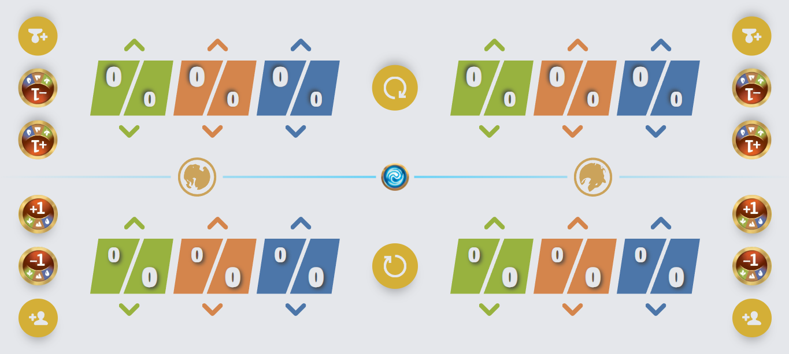
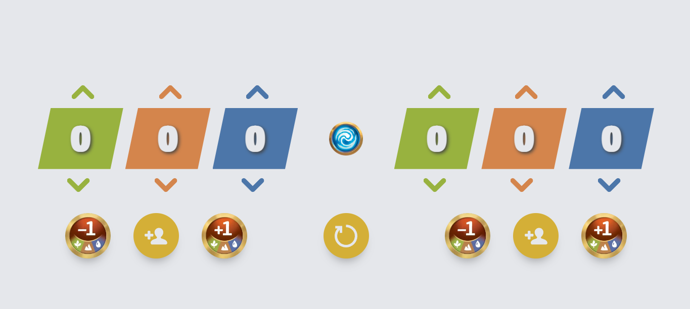
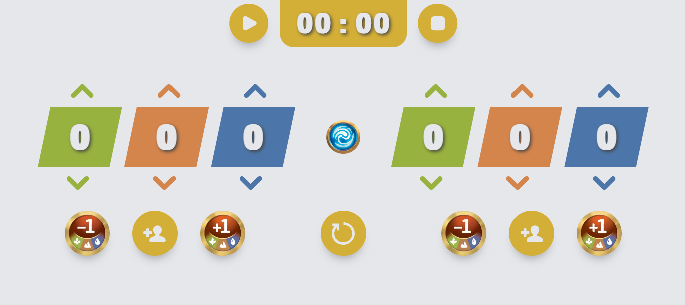
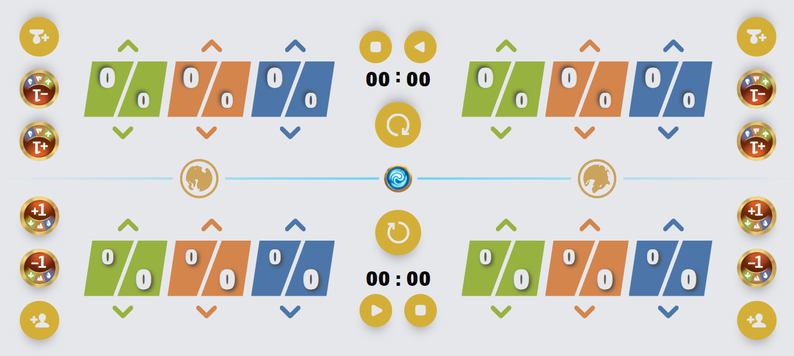
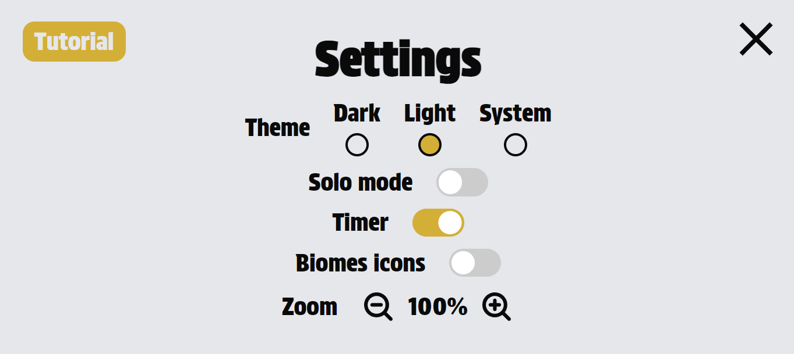

# Altered Counter PWA
Find the link to the application at this address :
[Altered Counter PWA](https://apps.mrdo.fr/altered/)

This pwa is a tool for the TCG Altered. Its purpose is to help players easily count the points present in each of the biomes of their expeditions.
There's a single-player mode and a 2-player mode, so you can use just one phone.

Note : This app is a fan project and is not associated with Equinox or Asmodee.

## How it works
You can increase or decrease the value of each biome in your expeditions using the arrows connected to them. You can also use the +1 or -1 boost to increase/decrease by 1 the value of all biomes in the desired expedition. You can also directly add the value of a character card using the "new character" button. Finally, the reset button sets the biomes of the 2 expeditions to 0. In 2-player mode, each of your biomes also indicates the value of the opponent's biomes.
You can click on the biomes you want to be inactive.

## Two-players Mode

On the 2 expeditions, you have real-time status of the corresponding tokens.  
● If no one is advancing, there are no arrows.  
● If you should advance, the arrow on your side will be visible, and the same applies to your opponent.  
● If you both have to advance, both arrows are visible.  
This system takes into consideration the state of the biomes.

##  One-Player Mode

This mode can be used in 1v1 or 2v2 mode, with each player using their own device.

##  Timer
You can activate a global timer in 2-player mode and a single timer in 1-player mode through the settings.
 

## Settings
You can open the settings by pressing the Altered logo in the center of the game.  
You can choose your preferred theme.
You can also enable a timer, a solo mode, biomes icons and zoom based on your preferences.

