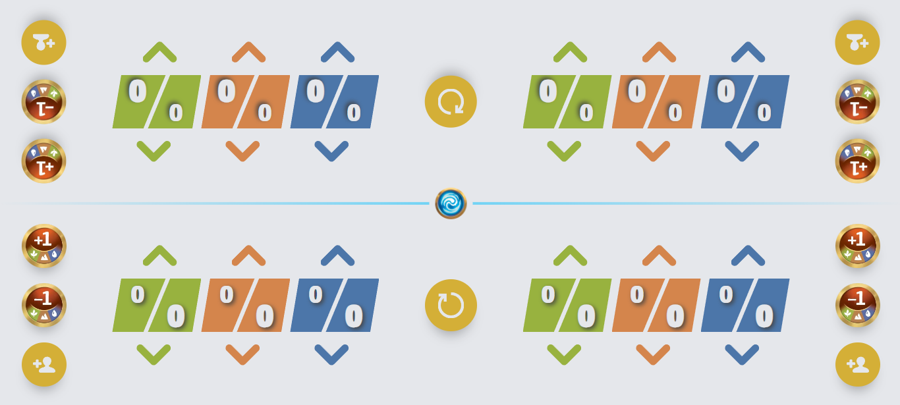
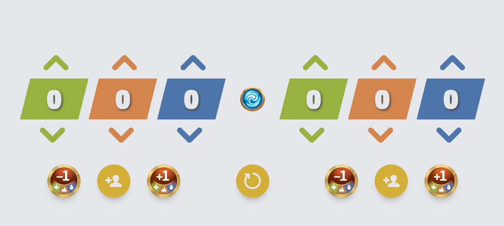
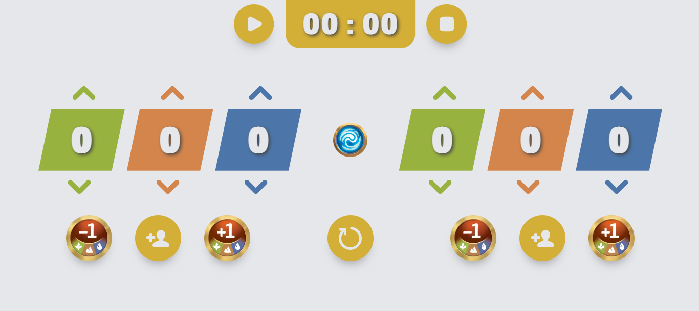
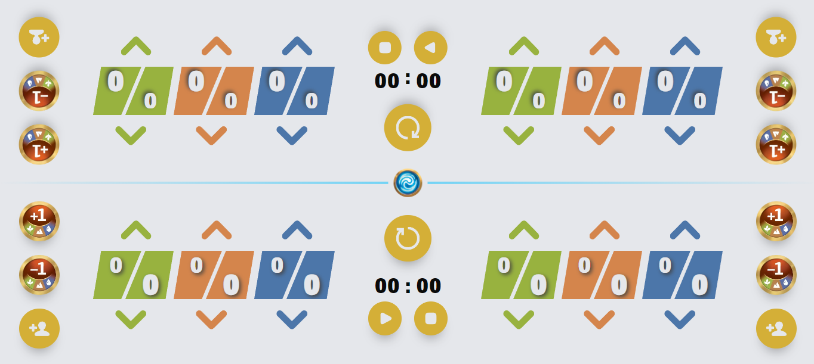

# Altered Counter PWA
Find the link to the application at this address : 
[Altered Counter PWA](https://alteredcounter.mrdo.fr)

This pwa is related to the TCG Altered. Its purpose is to help players easily count the points present in each of the biomes of their expeditions.
There's a single-player mode and a 2-player mode, so you can use just one phone.

## How it works
You can increase or decrease the value of each biome in your expeditions using the arrows connected to them. You can also use the +1 or -1 boost to increase/decrease the value of all biomes in the desired expedition. You can also directly add the value of a character card using the "new character" button. Finally, the reset button sets the biomes of the 2 expeditions to 0. In 2-player mode, each of your biomes also indicates the value of the opponent's biomes. 

## Two-players Mode

##  One-Player Mode

##  Timer
You can activate a global timer in 2-player mode and a single timer in 1-player mode through the settings
 

## Settings
You can open the settings by pressing the Altered logo in the center of the game.

